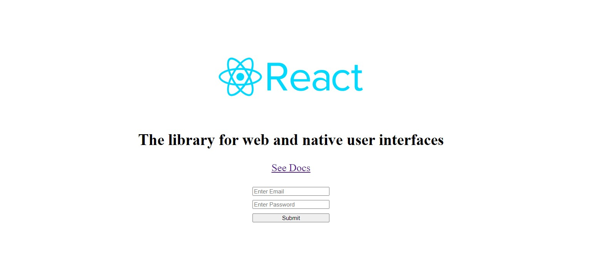

# ReactElement

## Basic Concepts

### What is ReactElement
- **Definition:** 
    - A `ReactElement` is an object representation of DOM element or a component in React.
    - It's the smallest unit that React uses to describe what we want to see on the screen.
- **Immutability:**
    - ReactElements are immutable, meaning once they are created, they cannot be changed.
    - If we want to update an element, we have to create new one.

### Creating a ReactElement
- We typically create `ReactElement` using JSX, but it's helpful to understand how it's created under the hood using the `React.createElement` method.

Using JSX
```javascript
const element = <h1>Hello, world!</h1>;
```
---
Using `React.createElement`
```javascript
const element = React.createElement(
  'h1',
  null,
  'Hello, world!'
);
```

- **Explanation:** `React.createElement` takes three arguments:
    - The type of element (e.g., `'h1'` for a heading).
    - The props object (e.g., `null` here means no additional attributes).
    - The children of the element, which can be text or other React elements.


---
---
## Creating the React Element Tree

### Top-Level div Element:

```javascript
const div = React.createElement(
  "div",
  { className: "container", id: "main" },
  ...
);
```

- **Type:** `"div"` indicates that this is a `div` element.
- **Props:** `{ className: "container", id: "main" }` sets the `className` and `id` attributes for the `div`.
- **Children:** The `div` element has several children, which are other `React.createElement` calls.

---

### Nested img Element:
```javascript
React.createElement(
  "img",
  {
    src: './React-Symbol.png',
    width: '20%'
  }
)
```
- **Type:** `"img"` creates an `img` element.
- **Props:**
    - `src: './React-Symbol.png'` specifies the image source.
    - `width: '20%'` sets the width of the image to 20% of its container.
- **Children:** `img` is a self-closing tag and doesn't require children, so this is handled by the props only.

### Nested section Element:
```javascript
React.createElement(
  "section",
  {},
  React.createElement(
    "h2",
    {},
    "The library for web and native user interfaces"
  ),
  React.createElement(
    "a",
    {
      href: "https://react.dev/",
      target: '_blank'
    },
    "See Docs"
  )
)
```

- **Type:** `"section"` creates a section element with no additional props.
- **Children:** Contains an `h2` and an `a` element.
    - **`h2` Element:** 
        - **Type:** `"h2"`
        - **Props:** An empty object, indicating no attributes are being set.
        - **Children:** A text node, "The library for web and native user interfaces".
    - **`a` Element:** 
        - **Type:** `"a"`
        - **Props:** 
            - `href: "https://react.dev/"` specifies the link's destination.
            - `target: '_blank'` opens the link in a new tab.
        -**Children:** A text node, "See Docs".

---

### Nested form Element:

```javascript
React.createElement('form', {
  id: 'myForm'
}, 
  React.createElement('input', {
    type: 'email',
    placeholder: 'Enter Email'
  }),
  React.createElement('input', {
    type: 'password',
    placeholder: 'Enter Password'
  }),
  React.createElement('input', {
    type: 'submit'
  })
)
```

- **Type:** `"form"` creates a form element with an `id` of "myForm".
- **Children:** Three input elements with different configurations.
    - **Email Input:** 
        - **Type:** `"input"`
        - **Props:** 
            - `type: 'email'` specifies the input type for email addresses.
            - `placeholder: 'Enter Email'` sets placeholder text.
    - **Password Input:** 
        - **Type:** `"input"`
        - **Props:** 
            - `type: 'password'` specifies the input type for passwords.
            - `placeholder: 'Enter Password'` sets placeholder text.
    - **Submit Input:** 
        - **Type:** `"input"`
        - **Props:** 
            - `type: 'submit'` specifies the input type to submit, creating a submit button.

---

### Rendering the Element Tree
```javascript
const reactClone = ReactDOM.createRoot(document.querySelector('#reactClone'))
```

- **Purpose:** `ReactDOM.createRoot` is used to create a root for the React application in the specified container.

- **Container:** `document.querySelector('#reactClone')` selects the DOM element with the `id` of "reactClone" to use as the root container for rendering the React element tree.

```javascript
root2.render(div)
```

- **Purpose:** This renders the previously created `div` element (which contains all the nested elements) into the DOM at the specified root container.


## Output
